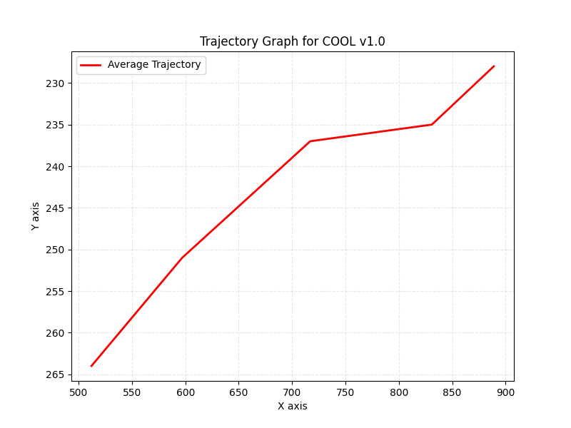

# ✈️ COOL v1.0 Engineering Flight Report

Generated for [Your Research Team] on August 16, 2025, 01:31 PM +06

Evaluated for aerodynamic performance and design optimization.

## Overview
- **Model**: COOL
- **Version**: 1.0
- **Design Notes**: i am nothing but cool
- **Created**: 2025-08-16 01:31 PM +06

## Visuals

## Average Metrics
| Metric    | Value      |
|--|--|
| Distance | 377.00 px |
| Airtime | 0.17 s |
| Speed | 2261.98 px/s |
| Stability | 10.00  |

**🏆 Achievement**: Best distance in test series!

## Per-Video Analysis
| Video Name | Distance (px) | Airtime (s) | Speed (px/s) | Stability | Performance Note |
|--|--|--|--|--|--|
| flight2 | 377.00 | 0.17 | 2261.98 | 10.00 | Longest flight |

**Stats**: Standard Deviation: Distance: 0.00px, Stability: 0.00 (highly consistent)

## Research Insights
- **Stability**: 10.0/10, excellent for controlled flights
- **Recommendation**: Airtime 0.2s < 4s target—try lighter paper or sharper wings
- **Note**: Consistent metrics suggest reliability for further testing

**Share your findings on X with #LucidraftDeltaX to discuss with the research community! 🚀**
